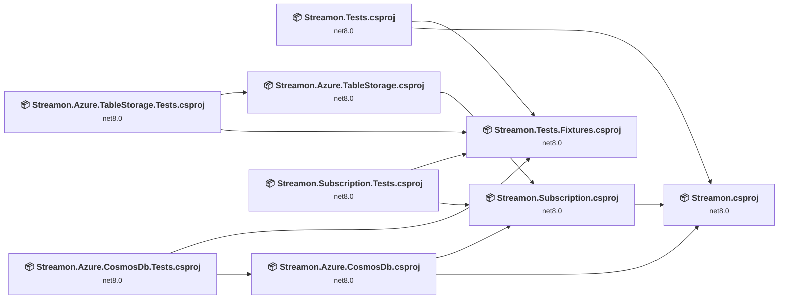
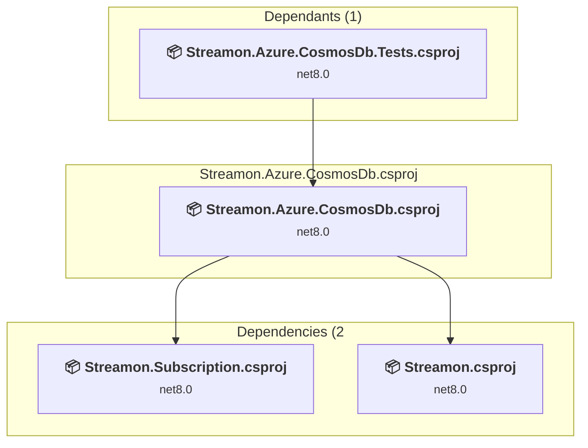
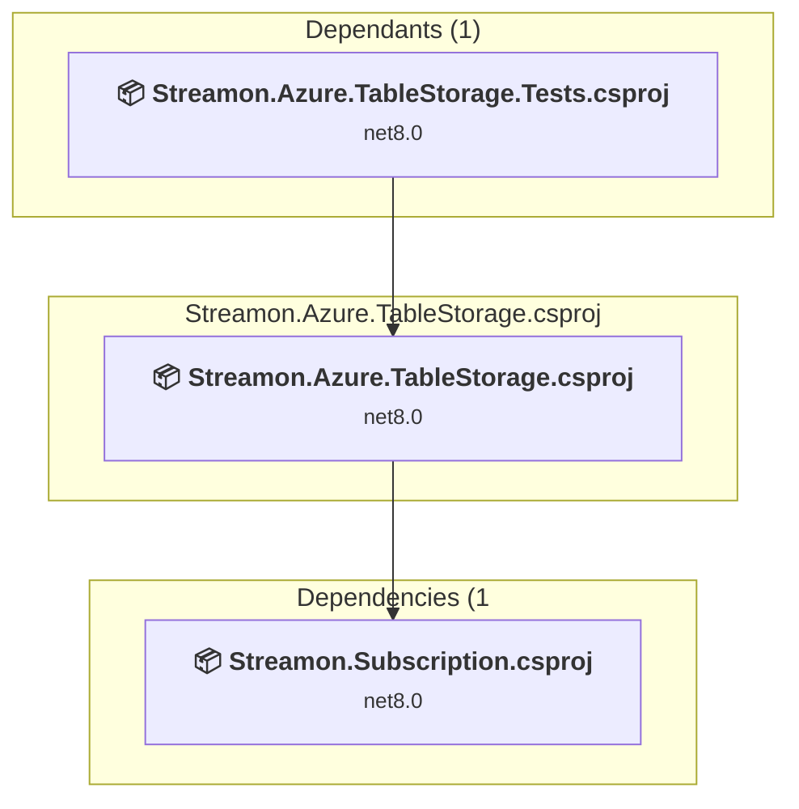
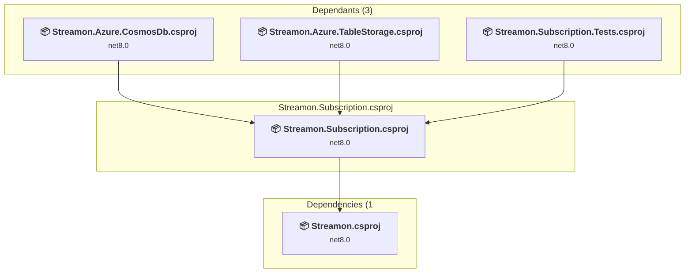
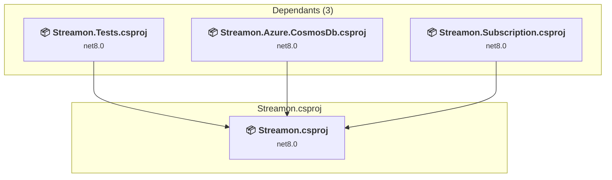
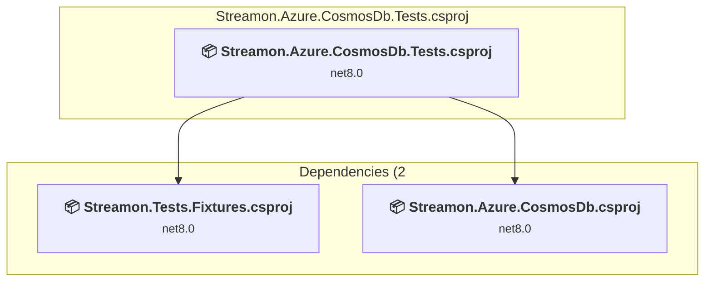
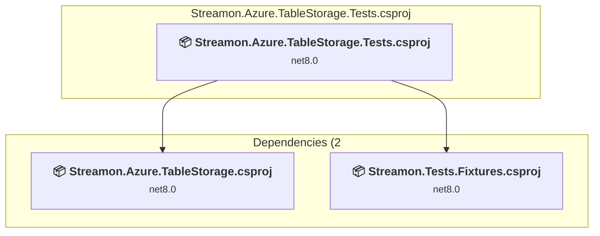
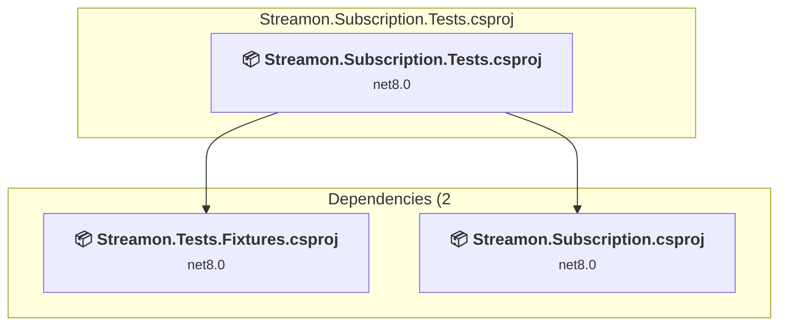
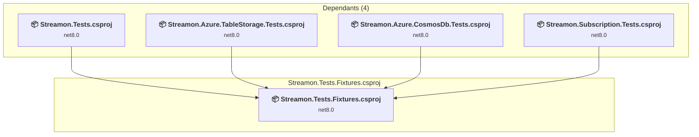
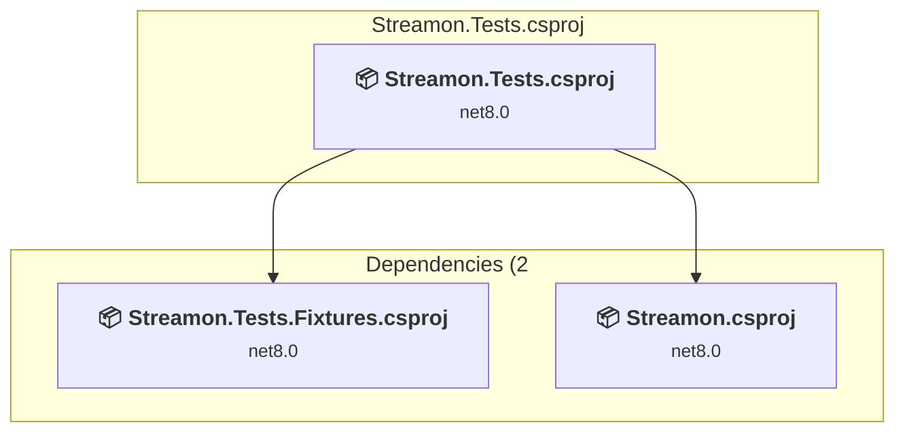

# Projects and dependencies analysis

This document provides a comprehensive overview of the projects and their dependencies in the context of upgrading to .NETCoreApp,Version=v8.0.

## Table of Contents

- [Executive Summary](#executive-Summary)
  - [Highlevel Metrics](#highlevel-metrics)
  - [Projects Compatibility](#projects-compatibility)
  - [Package Compatibility](#package-compatibility)
  - [API Compatibility](#api-compatibility)
- [Aggregate NuGet packages details](#aggregate-nuget-packages-details)
- [Top API Migration Challenges](#top-api-migration-challenges)
  - [Technologies and Features](#technologies-and-features)
  - [Most Frequent API Issues](#most-frequent-api-issues)
- [Projects Relationship Graph](#projects-relationship-graph)
- [Project Details](#project-details)

  - [src\Streamon.Azure.CosmosDb\Streamon.Azure.CosmosDb.csproj](#srcstreamonazurecosmosdbstreamonazurecosmosdbcsproj)
  - [src\Streamon.Azure.TableStorage\Streamon.Azure.TableStorage.csproj](#srcstreamonazuretablestoragestreamonazuretablestoragecsproj)
  - [src\Streamon.Subscription\Streamon.Subscription.csproj](#srcstreamonsubscriptionstreamonsubscriptioncsproj)
  - [src\Streamon\Streamon.csproj](#srcstreamonstreamoncsproj)
  - [test\Streamon.Azure.CosmosDb.Tests\Streamon.Azure.CosmosDb.Tests.csproj](#teststreamonazurecosmosdbtestsstreamonazurecosmosdbtestscsproj)
  - [test\Streamon.Azure.TableStorage.Tests\Streamon.Azure.TableStorage.Tests.csproj](#teststreamonazuretablestoragetestsstreamonazuretablestoragetestscsproj)
  - [test\Streamon.Subscription.Tests\Streamon.Subscription.Tests.csproj](#teststreamonsubscriptiontestsstreamonsubscriptiontestscsproj)
  - [test\Streamon.Tests.Fixtures\Streamon.Tests.Fixtures.csproj](#teststreamontestsfixturesstreamontestsfixturescsproj)
  - [test\Streamon.Tests\Streamon.Tests.csproj](#teststreamontestsstreamontestscsproj)

## Executive Summary

### Highlevel Metrics

| Metric | Count | Status |
| :--- | :---: | :--- |
| Total Projects | 9 | 0 require upgrade |
| Total NuGet Packages | 16 | All compatible |
| Total Code Files | 123 |  |
| Total Code Files with Incidents | 0 |  |
| Total Lines of Code | 4683 |  |
| Total Number of Issues | 0 |  |
| Estimated LOC to modify | 0+ | at least 0.0% of codebase |

### Projects Compatibility

| Project | Target Framework | Difficulty | Package Issues | API Issues | Est. LOC Impact | Description |
| :--- | :---: | :---: | :---: | :---: | :---: | :--- |
| [src\Streamon.Azure.CosmosDb\Streamon.Azure.CosmosDb.csproj](#srcstreamonazurecosmosdbstreamonazurecosmosdbcsproj) | net8.0 | ✅ None | 0 | 0 |  | ClassLibrary, Sdk Style = True |
| [src\Streamon.Azure.TableStorage\Streamon.Azure.TableStorage.csproj](#srcstreamonazuretablestoragestreamonazuretablestoragecsproj) | net8.0 | ✅ None | 0 | 0 |  | ClassLibrary, Sdk Style = True |
| [src\Streamon.Subscription\Streamon.Subscription.csproj](#srcstreamonsubscriptionstreamonsubscriptioncsproj) | net8.0 | ✅ None | 0 | 0 |  | ClassLibrary, Sdk Style = True |
| [src\Streamon\Streamon.csproj](#srcstreamonstreamoncsproj) | net8.0 | ✅ None | 0 | 0 |  | ClassLibrary, Sdk Style = True |
| [test\Streamon.Azure.CosmosDb.Tests\Streamon.Azure.CosmosDb.Tests.csproj](#teststreamonazurecosmosdbtestsstreamonazurecosmosdbtestscsproj) | net8.0 | ✅ None | 0 | 0 |  | DotNetCoreApp, Sdk Style = True |
| [test\Streamon.Azure.TableStorage.Tests\Streamon.Azure.TableStorage.Tests.csproj](#teststreamonazuretablestoragetestsstreamonazuretablestoragetestscsproj) | net8.0 | ✅ None | 0 | 0 |  | DotNetCoreApp, Sdk Style = True |
| [test\Streamon.Subscription.Tests\Streamon.Subscription.Tests.csproj](#teststreamonsubscriptiontestsstreamonsubscriptiontestscsproj) | net8.0 | ✅ None | 0 | 0 |  | DotNetCoreApp, Sdk Style = True |
| [test\Streamon.Tests.Fixtures\Streamon.Tests.Fixtures.csproj](#teststreamontestsfixturesstreamontestsfixturescsproj) | net8.0 | ✅ None | 0 | 0 |  | ClassLibrary, Sdk Style = True |
| [test\Streamon.Tests\Streamon.Tests.csproj](#teststreamontestsstreamontestscsproj) | net8.0 | ✅ None | 0 | 0 |  | DotNetCoreApp, Sdk Style = True |

### Package Compatibility

| Status | Count | Percentage |
| :--- | :---: | :---: |
| ✅ Compatible | 16 | 100.0% |
| ⚠️ Incompatible | 0 | 0.0% |
| 🔄 Upgrade Recommended | 0 | 0.0% |
| ***Total NuGet Packages*** | ***16*** | ***100%*** |

### API Compatibility

| Category | Count | Impact |
| :--- | :---: | :--- |
| 🔴 Binary Incompatible | 0 | High - Require code changes |
| 🟡 Source Incompatible | 0 | Medium - Needs re-compilation and potential conflicting API error fixing |
| 🔵 Behavioral change | 0 | Low - Behavioral changes that may require testing at runtime |
| ✅ Compatible | 0 |  |
| ***Total APIs Analyzed*** | ***0*** |  |

## Aggregate NuGet packages details

| Package | Current Version | Suggested Version | Projects | Description |
| :--- | :---: | :---: | :--- | :--- |
| Azure.Data.Tables | 12.9.1 |  | [Streamon.Azure.TableStorage.csproj](#srcstreamonazuretablestoragestreamonazuretablestoragecsproj) | ✅Compatible |
| coverlet.collector | 6.0.2 |  | [Streamon.Azure.CosmosDb.Tests.csproj](#teststreamonazurecosmosdbtestsstreamonazurecosmosdbtestscsproj) [Streamon.Azure.TableStorage.Tests.csproj](#teststreamonazuretablestoragetestsstreamonazuretablestoragetestscsproj) [Streamon.Subscription.Tests.csproj](#teststreamonsubscriptiontestsstreamonsubscriptiontestscsproj) [Streamon.Tests.csproj](#teststreamontestsstreamontestscsproj) | ✅Compatible |
| Microsoft.Azure.Cosmos | 3.46.0 |  | [Streamon.Azure.CosmosDb.csproj](#srcstreamonazurecosmosdbstreamonazurecosmosdbcsproj) | ✅Compatible |
| Microsoft.Extensions.DependencyInjection | 8.0.1 |  | [Streamon.Azure.CosmosDb.Tests.csproj](#teststreamonazurecosmosdbtestsstreamonazurecosmosdbtestscsproj) [Streamon.Azure.TableStorage.Tests.csproj](#teststreamonazuretablestoragetestsstreamonazuretablestoragetestscsproj) [Streamon.Subscription.Tests.csproj](#teststreamonsubscriptiontestsstreamonsubscriptiontestscsproj) [Streamon.Tests.csproj](#teststreamontestsstreamontestscsproj) | ✅Compatible |
| Microsoft.Extensions.DependencyInjection.Abstractions | 8.0.2 |  | [Streamon.csproj](#srcstreamonstreamoncsproj) | ✅Compatible |
| Microsoft.Extensions.Options | 8.0.2 |  | [Streamon.csproj](#srcstreamonstreamoncsproj) | ✅Compatible |
| Microsoft.NET.Test.Sdk | 17.12.0 |  | [Streamon.Azure.CosmosDb.Tests.csproj](#teststreamonazurecosmosdbtestsstreamonazurecosmosdbtestscsproj) [Streamon.Azure.TableStorage.Tests.csproj](#teststreamonazuretablestoragetestsstreamonazuretablestoragetestscsproj) [Streamon.Subscription.Tests.csproj](#teststreamonsubscriptiontestsstreamonsubscriptiontestscsproj) [Streamon.Tests.csproj](#teststreamontestsstreamontestscsproj) | ✅Compatible |
| Newtonsoft.Json | 13.0.3 |  | [Streamon.Azure.CosmosDb.csproj](#srcstreamonazurecosmosdbstreamonazurecosmosdbcsproj) [Streamon.Azure.CosmosDb.Tests.csproj](#teststreamonazurecosmosdbtestsstreamonazurecosmosdbtestscsproj) [Streamon.Azure.TableStorage.Tests.csproj](#teststreamonazuretablestoragetestsstreamonazuretablestoragetestscsproj) [Streamon.Subscription.Tests.csproj](#teststreamonsubscriptiontestsstreamonsubscriptiontestscsproj) [Streamon.Tests.csproj](#teststreamontestsstreamontestscsproj) | ✅Compatible |
| System.Text.Json | 8.0.5 |  | [Streamon.Azure.CosmosDb.csproj](#srcstreamonazurecosmosdbstreamonazurecosmosdbcsproj) [Streamon.Azure.CosmosDb.Tests.csproj](#teststreamonazurecosmosdbtestsstreamonazurecosmosdbtestscsproj) [Streamon.Azure.TableStorage.csproj](#srcstreamonazuretablestoragestreamonazuretablestoragecsproj) [Streamon.Azure.TableStorage.Tests.csproj](#teststreamonazuretablestoragetestsstreamonazuretablestoragetestscsproj) | ✅Compatible |
| Testcontainers.Azurite | 4.0.0 |  | [Streamon.Azure.TableStorage.Tests.csproj](#teststreamonazuretablestoragetestsstreamonazuretablestoragetestscsproj) | ✅Compatible |
| Testcontainers.CosmosDb | 4.0.0 |  | [Streamon.Azure.CosmosDb.Tests.csproj](#teststreamonazurecosmosdbtestsstreamonazurecosmosdbtestscsproj) | ✅Compatible |
| Ulid | 1.3.4 |  | [Streamon.csproj](#srcstreamonstreamoncsproj) | ✅Compatible |
| xunit | 2.9.2 |  | [Streamon.Azure.CosmosDb.Tests.csproj](#teststreamonazurecosmosdbtestsstreamonazurecosmosdbtestscsproj) [Streamon.Azure.TableStorage.Tests.csproj](#teststreamonazuretablestoragetestsstreamonazuretablestoragetestscsproj) [Streamon.Subscription.Tests.csproj](#teststreamonsubscriptiontestsstreamonsubscriptiontestscsproj) [Streamon.Tests.csproj](#teststreamontestsstreamontestscsproj) | ✅Compatible |
| xunit.abstractions | 2.0.3 |  | [Streamon.Tests.Fixtures.csproj](#teststreamontestsfixturesstreamontestsfixturescsproj) | ✅Compatible |
| xunit.core | 2.9.2 |  | [Streamon.Tests.Fixtures.csproj](#teststreamontestsfixturesstreamontestsfixturescsproj) | ✅Compatible |
| xunit.runner.visualstudio | 2.8.2 |  | [Streamon.Azure.CosmosDb.Tests.csproj](#teststreamonazurecosmosdbtestsstreamonazurecosmosdbtestscsproj) [Streamon.Azure.TableStorage.Tests.csproj](#teststreamonazuretablestoragetestsstreamonazuretablestoragetestscsproj) [Streamon.Subscription.Tests.csproj](#teststreamonsubscriptiontestsstreamonsubscriptiontestscsproj) [Streamon.Tests.csproj](#teststreamontestsstreamontestscsproj) | ✅Compatible |

## Top API Migration Challenges

### Technologies and Features

| Technology | Issues | Percentage | Migration Path |
| :--- | :---: | :---: | :--- |

### Most Frequent API Issues

| API | Count | Percentage | Category |
| :--- | :---: | :---: | :--- |

## Projects Relationship Graph

Legend:
📦 SDK-style project
⚙️ Classic project

## Project Details

### src\Streamon.Azure.CosmosDb\Streamon.Azure.CosmosDb.csproj

#### Project Info

- **Current Target Framework:** net8.0✅
- **SDK-style**: True
- **Project Kind:** ClassLibrary
- **Dependencies**: 2
- **Dependants**: 1
- **Number of Files**: 9
- **Lines of Code**: 278
- **Estimated LOC to modify**: 0+ (at least 0.0% of the project)

#### Dependency Graph

Legend:
📦 SDK-style project
⚙️ Classic project

### API Compatibility

| Category | Count | Impact |
| :--- | :---: | :--- |
| 🔴 Binary Incompatible | 0 | High - Require code changes |
| 🟡 Source Incompatible | 0 | Medium - Needs re-compilation and potential conflicting API error fixing |
| 🔵 Behavioral change | 0 | Low - Behavioral changes that may require testing at runtime |
| ✅ Compatible | 0 |  |
| ***Total APIs Analyzed*** | ***0*** |  |

### src\Streamon.Azure.TableStorage\Streamon.Azure.TableStorage.csproj

#### Project Info

- **Current Target Framework:** net8.0✅
- **SDK-style**: True
- **Project Kind:** ClassLibrary
- **Dependencies**: 1
- **Dependants**: 1
- **Number of Files**: 22
- **Lines of Code**: 1023
- **Estimated LOC to modify**: 0+ (at least 0.0% of the project)

#### Dependency Graph

Legend:
📦 SDK-style project
⚙️ Classic project

### API Compatibility

| Category | Count | Impact |
| :--- | :---: | :--- |
| 🔴 Binary Incompatible | 0 | High - Require code changes |
| 🟡 Source Incompatible | 0 | Medium - Needs re-compilation and potential conflicting API error fixing |
| 🔵 Behavioral change | 0 | Low - Behavioral changes that may require testing at runtime |
| ✅ Compatible | 0 |  |
| ***Total APIs Analyzed*** | ***0*** |  |

### src\Streamon.Subscription\Streamon.Subscription.csproj

#### Project Info

- **Current Target Framework:** net8.0✅
- **SDK-style**: True
- **Project Kind:** ClassLibrary
- **Dependencies**: 1
- **Dependants**: 3
- **Number of Files**: 29
- **Lines of Code**: 927
- **Estimated LOC to modify**: 0+ (at least 0.0% of the project)

#### Dependency Graph

Legend:
📦 SDK-style project
⚙️ Classic project

### API Compatibility

| Category | Count | Impact |
| :--- | :---: | :--- |
| 🔴 Binary Incompatible | 0 | High - Require code changes |
| 🟡 Source Incompatible | 0 | Medium - Needs re-compilation and potential conflicting API error fixing |
| 🔵 Behavioral change | 0 | Low - Behavioral changes that may require testing at runtime |
| ✅ Compatible | 0 |  |
| ***Total APIs Analyzed*** | ***0*** |  |

### src\Streamon\Streamon.csproj

#### Project Info

- **Current Target Framework:** net8.0✅
- **SDK-style**: True
- **Project Kind:** ClassLibrary
- **Dependencies**: 0
- **Dependants**: 3
- **Number of Files**: 39
- **Lines of Code**: 663
- **Estimated LOC to modify**: 0+ (at least 0.0% of the project)

#### Dependency Graph

Legend:
📦 SDK-style project
⚙️ Classic project

### API Compatibility

| Category | Count | Impact |
| :--- | :---: | :--- |
| 🔴 Binary Incompatible | 0 | High - Require code changes |
| 🟡 Source Incompatible | 0 | Medium - Needs re-compilation and potential conflicting API error fixing |
| 🔵 Behavioral change | 0 | Low - Behavioral changes that may require testing at runtime |
| ✅ Compatible | 0 |  |
| ***Total APIs Analyzed*** | ***0*** |  |

### test\Streamon.Azure.CosmosDb.Tests\Streamon.Azure.CosmosDb.Tests.csproj

#### Project Info

- **Current Target Framework:** net8.0✅
- **SDK-style**: True
- **Project Kind:** DotNetCoreApp
- **Dependencies**: 2
- **Dependants**: 0
- **Number of Files**: 4
- **Lines of Code**: 51
- **Estimated LOC to modify**: 0+ (at least 0.0% of the project)

#### Dependency Graph

Legend:
📦 SDK-style project
⚙️ Classic project

### API Compatibility

| Category | Count | Impact |
| :--- | :---: | :--- |
| 🔴 Binary Incompatible | 0 | High - Require code changes |
| 🟡 Source Incompatible | 0 | Medium - Needs re-compilation and potential conflicting API error fixing |
| 🔵 Behavioral change | 0 | Low - Behavioral changes that may require testing at runtime |
| ✅ Compatible | 0 |  |
| ***Total APIs Analyzed*** | ***0*** |  |

### test\Streamon.Azure.TableStorage.Tests\Streamon.Azure.TableStorage.Tests.csproj

#### Project Info

- **Current Target Framework:** net8.0✅
- **SDK-style**: True
- **Project Kind:** DotNetCoreApp
- **Dependencies**: 2
- **Dependants**: 0
- **Number of Files**: 11
- **Lines of Code**: 834
- **Estimated LOC to modify**: 0+ (at least 0.0% of the project)

#### Dependency Graph

Legend:
📦 SDK-style project
⚙️ Classic project

### API Compatibility

| Category | Count | Impact |
| :--- | :---: | :--- |
| 🔴 Binary Incompatible | 0 | High - Require code changes |
| 🟡 Source Incompatible | 0 | Medium - Needs re-compilation and potential conflicting API error fixing |
| 🔵 Behavioral change | 0 | Low - Behavioral changes that may require testing at runtime |
| ✅ Compatible | 0 |  |
| ***Total APIs Analyzed*** | ***0*** |  |

### test\Streamon.Subscription.Tests\Streamon.Subscription.Tests.csproj

#### Project Info

- **Current Target Framework:** net8.0✅
- **SDK-style**: True
- **Project Kind:** DotNetCoreApp
- **Dependencies**: 2
- **Dependants**: 0
- **Number of Files**: 5
- **Lines of Code**: 527
- **Estimated LOC to modify**: 0+ (at least 0.0% of the project)

#### Dependency Graph

Legend:
📦 SDK-style project
⚙️ Classic project

### API Compatibility

| Category | Count | Impact |
| :--- | :---: | :--- |
| 🔴 Binary Incompatible | 0 | High - Require code changes |
| 🟡 Source Incompatible | 0 | Medium - Needs re-compilation and potential conflicting API error fixing |
| 🔵 Behavioral change | 0 | Low - Behavioral changes that may require testing at runtime |
| ✅ Compatible | 0 |  |
| ***Total APIs Analyzed*** | ***0*** |  |

### test\Streamon.Tests.Fixtures\Streamon.Tests.Fixtures.csproj

#### Project Info

- **Current Target Framework:** net8.0✅
- **SDK-style**: True
- **Project Kind:** ClassLibrary
- **Dependencies**: 0
- **Dependants**: 4
- **Number of Files**: 5
- **Lines of Code**: 106
- **Estimated LOC to modify**: 0+ (at least 0.0% of the project)

#### Dependency Graph

Legend:
📦 SDK-style project
⚙️ Classic project

### API Compatibility

| Category | Count | Impact |
| :--- | :---: | :--- |
| 🔴 Binary Incompatible | 0 | High - Require code changes |
| 🟡 Source Incompatible | 0 | Medium - Needs re-compilation and potential conflicting API error fixing |
| 🔵 Behavioral change | 0 | Low - Behavioral changes that may require testing at runtime |
| ✅ Compatible | 0 |  |
| ***Total APIs Analyzed*** | ***0*** |  |

### test\Streamon.Tests\Streamon.Tests.csproj

#### Project Info

- **Current Target Framework:** net8.0✅
- **SDK-style**: True
- **Project Kind:** DotNetCoreApp
- **Dependencies**: 2
- **Dependants**: 0
- **Number of Files**: 7
- **Lines of Code**: 274
- **Estimated LOC to modify**: 0+ (at least 0.0% of the project)

#### Dependency Graph

Legend:
📦 SDK-style project
⚙️ Classic project

### API Compatibility

| Category | Count | Impact |
| :--- | :---: | :--- |
| 🔴 Binary Incompatible | 0 | High - Require code changes |
| 🟡 Source Incompatible | 0 | Medium - Needs re-compilation and potential conflicting API error fixing |
| 🔵 Behavioral change | 0 | Low - Behavioral changes that may require testing at runtime |
| ✅ Compatible | 0 |  |
| ***Total APIs Analyzed*** | ***0*** |  |

